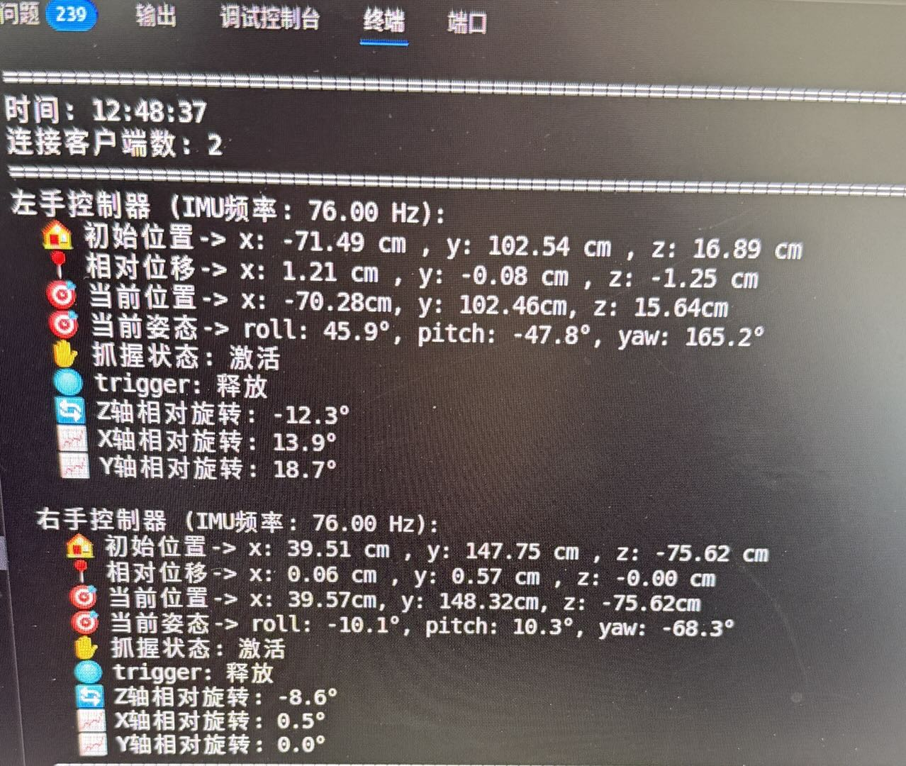

#Piper VR-Teleop

###  描述：
该项目实现了基于VR的机械臂控制。机械臂采用松灵机器人6Dof piper机械臂*2 
通过webXR和webSocket/Server获取VR手柄的位姿，并基于增量来控制机械臂移动。

<p align="center">
    
</p>

<p align="center">
    
</p>


###  使用
1.依赖python==3.10.18环境，最好创建conda虚拟环境。
2.依赖[lerobot项目](https://github.com/huggingface/lerobot.git),切换到哈希码69901b9b的commit后安装：pip install -e .(外层lerobot目录下操作)。
3.依赖[松灵piper机械臂的SDK](https://github.com/agilexrobotics/piper_sdk.git)，切换到版本0.4.3后安装：pip install .(外层piper_sdk目录下操作)。
4.按照[松灵piper机械臂的SDK](https://github.com/agilexrobotics/piper_sdk.git)指示激活双臂的CAN模块,要注意can-utils的版本问题,默认apt install的版本可能比较旧，容易导致机械臂的CAN通信失败,可以手动安装较新版本的can-utils:
``` bash
cd /tmp
git clone https://github.com/linux-can/can-utils.git
cd can-utils
make
sudo make install
```
5.之后可以运行松灵机械臂的一些demo来测试一下机械臂是否能正常使用。
6.之后运行脚本qijia-teleopvr/telegrip/telegrip/**main_vr_control_piper_V8_mit_interpolation.py**，注意文件中piper机械臂的urdf文件的绝对路径和urdf文件里面的STL文件的绝对路径是否正确；也可以运行同目录其他以main_vr_control_piper相关的demo代码，具体参照文件开头的说明；按照指示将VR头显跟PC连接到同一个网段（通常指连接至同一个wifi路由器），之后在VR头显中访问PC电脑IP的8443端口，点击网页中间的开始控制按钮就可以通过手柄控制双臂，中途如果取下过头显，再次控制时需要最好刷新一下网页。
7.手柄使用：
- 每个手柄的侧边按钮**保持按下**才可以触发相应的机械臂控制，类似离合的作用，即走即停
- 每个手柄的trigger按钮都可以控制对应机械臂夹爪的抓取（**需按住离合按钮**）
- 每个手柄均具有一键让机械臂回到初始位置的功能，这个功能主要作为一种安全机制；左手柄是**X键**，右手柄是**A键**(**均需松开侧边离合按钮才能生效~**)
